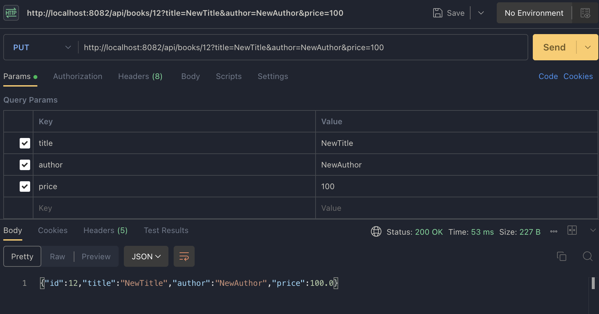
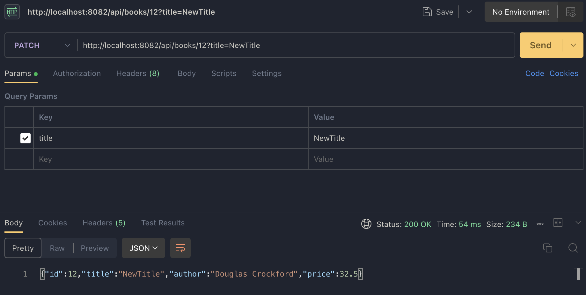
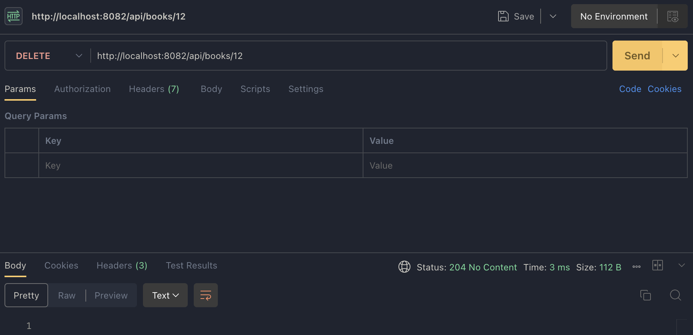
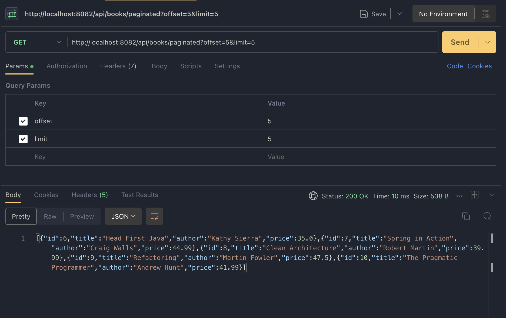
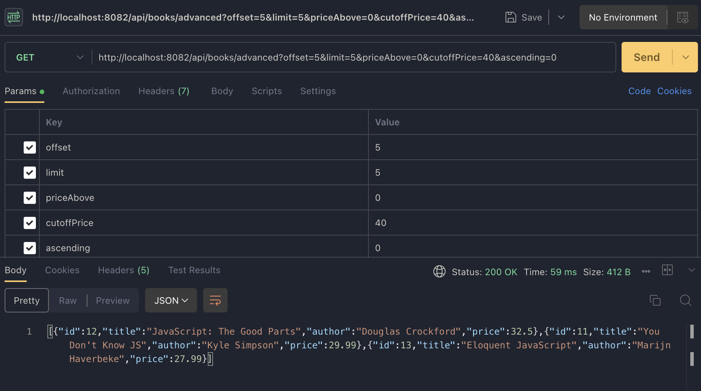

# Homework 1- Building on Books API Advanced Endpoints Features

## PUT /api/books/{id}
### Description
Replaces **all fields** of a book.

All parameters are required.

### Query Parameters
| Parameter     | Type    |
|--------------|---------|
| `title`       | `String` |
| `author`        | `String`  |
| `price`        | `double`  |

### Responses
- `200 OK` – Book updated
- `404 Not Found` – Book does not exist

## PATCH /api/books/{id}

### Description
Updates **only provided fields**.

All parameters are optional.

### Query Parameters
| Parameter     | Type    |
|--------------|---------|
| `title`       | `String` |
| `author`        | `String`  |
| `price`        | `double`  |

## DELETE /api/books/{id}

### Description
Deletes a book by ID.

### Responses
- `204 No Content` – Successfully deleted
- `404 Not Found` – Book not found

## GET /api/books/paginated

### Description
Returns a subset of books using offset/limit pagination.

### Query Parameters
| Parameter     | Type    | Description |
|--------------|---------|------------|
| `offset`       | `Long`    | Number of books to skip |
| `limit`        | `Long`    | Number of books to return |

### Behavior
- Skips `offset` number of books
- Returns up to `limit` books

## GET /api/books/advanced

### Description
Combines:

1. Filtering by price  
2. Sorting by price  
3. Offset/limit pagination  

Operations are applied in this order:
1. Filter
2. Sort
3. Paginate

### Query Parameters

| Parameter     | Type    | Description |
|--------------|---------|------------|
| `offset`       | `Long`    | Number of books to skip |
| `limit`        | `Long`    | Number of books to return |
| `priceAbove`   | `boolean` | If `true` → filter price `> cutoffPrice` If `false` → filter price `< cutoffPrice` |
| `cutoffPrice`  | `double`  | Price threshold |
| `ascending`    | `boolean` | `true` → ascending order `false` → descending order |

